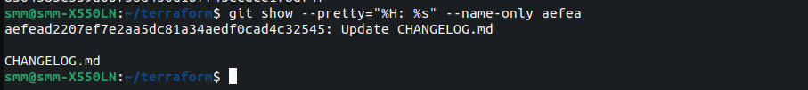
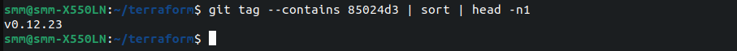
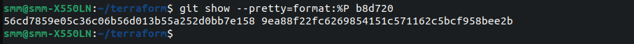
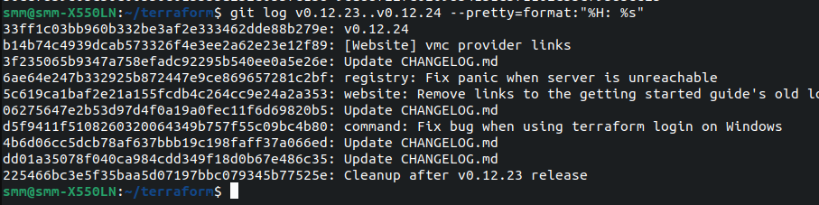
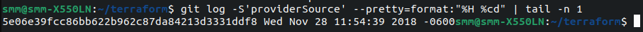
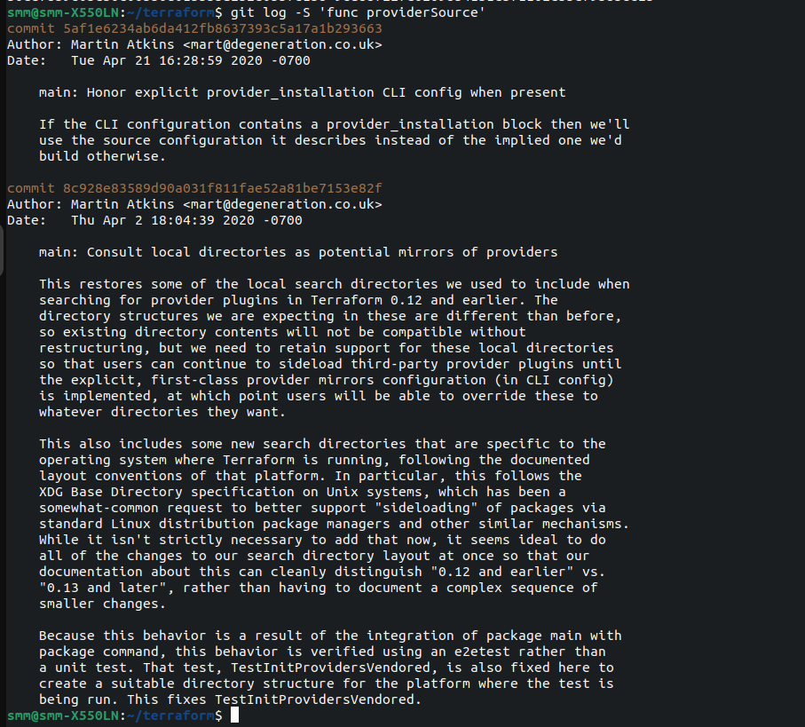
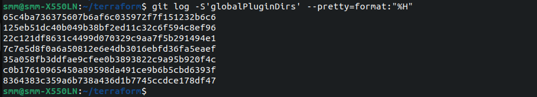
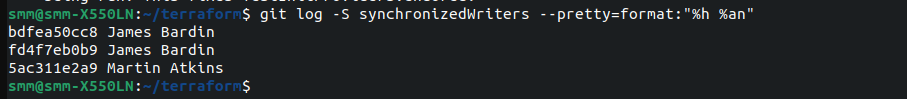

# Домашнее задание к занятию «Инструменты Git» - Михалёв Сергей

### Цель задания

В результате выполнения задания вы:

* научитесь работать с утилитами Git;
* потренируетесь решать типовые задачи, возникающие при работе в команде. 

### Инструкция к заданию

1. Склонируйте [репозиторий](https://github.com/hashicorp/terraform) с исходным кодом Terraform.
2. Создайте файл для ответов на задания в своём репозитории, после выполнения прикрепите ссылку на .md-файл с ответами в личном кабинете.
3. Любые вопросы по решению задач задавайте в чате учебной группы.

------

## Задание

В клонированном репозитории:

1. Найдите полный хеш и комментарий коммита, хеш которого начинается на `aefea`.

**Ответ**</br>
  Использовал команду ```git show --pretty="%H: %s" --name-only aefea``` вместо ```git show aefea``` что бы сократить вывод.</br>
  

2. Ответьте на вопросы.

* Какому тегу соответствует коммит `85024d3`?

**Ответ**</br>
  Использовал команду ```git tag --contains 85024d3 | sort | head -n1``` так же подойдёт просто ```git log -1 85024d3```.</br>
  
  
* Сколько родителей у коммита `b8d720`? Напишите их хеши.

**Ответ**</br>
  Можно найти информацию о родителях в выводе команды ```git log -1 b8d720```, я спользовал команду ```git show --pretty=format:%P b8d720``` для более точно й информации. Родителей два, их хеши:</br>56cd7859e05c36c06b56d013b55a252d0bb7e158 </br>9ea88f22fc6269854151c571162c5bcf958bee2b</br>
  </br>
  
* Перечислите хеши и комментарии всех коммитов, которые были сделаны между тегами  v0.12.23 и v0.12.24.

**Ответ**</br>
  Использовал команду ```git log v0.12.23..v0.12.24 --pretty=format:"%H: %s"```</br>
  </br>
* Найдите коммит, в котором была создана функция `func providerSource`, её определение в коде выглядит так: `func providerSource(...)` (вместо троеточия перечислены аргументы).

**Ответ**</br>
  Использовал команду ```git log -S'providerSource' --pretty=format:"%H %cd" | tail -n 1```</br>
  </br>
  Полную же информацию о фунции можно получить командой ```git log -S 'func providerSource'```</br>
  </br>
* Найдите все коммиты, в которых была изменена функция `globalPluginDirs`.

**Ответ**</br>
  Наиболее полный ответ будет содержаться в выводе команды ```git log -GglobalPluginDirs --stat```, яже использовал команду ```git log -S'globalPluginDirs' --pretty=format:"%H"``` для вывода списка коммитов без лишней информации.</br>
  </br>
* Кто автор функции `synchronizedWriters`?

**Ответ**</br>
  У этой функции два автора:  James Bardin и Martin Atkins. ```git log -S synchronizedWriters --pretty=format:"%h %an"```</br>
  </br>
